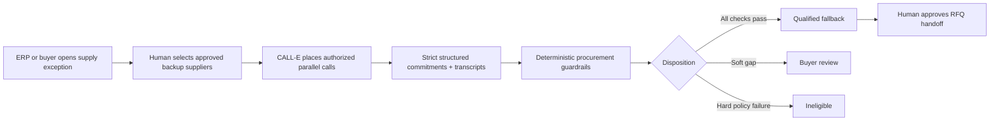

# CapacityLine

**Call suppliers. Secure capacity. Keep the line moving.**

CapacityLine is an AI supply recovery desk that calls pre-approved backup suppliers, obtains live quantity and delivery commitments, checks them against procurement requirements, and gives a buyer the first actionable fallback before production stops.

Built for the **Most Practical Use Case** prize in [CALL-E: Your Code Is Calling](https://call-e.devpost.com/).

**[Open the live demo](https://capacityline.vercel.app)** · **[Watch the 2:44 demo video](https://youtu.be/5ond4ajvsMg)**

Choose **Safe demo** to run the complete fictional scenario with no phone call.

> The included scenario, suppliers, transcripts, impact figures, and benchmark times are fictional. Demo mode never creates a phone call.

## The problem

Risk tools can warn that a supplier is late or disrupted. Supplier databases can suggest alternatives. Neither proves who can supply the required part **right now**, in the required quantity, by the required date, under the buyer's quality and origin rules. Buyers still close that last mile with serial calls, notes, and spreadsheets while the line-stop clock runs.

CapacityLine starts after the exception is known. It turns approved supplier contacts into comparable, evidence-backed commitments:



The north-star metric is **Time to First Qualified Fallback**: elapsed time from the creation of a supply exception to the first transcript-grounded supplier commitment that passes every buyer rule.

## What the demo proves

- A 90-second in-product guide makes the complete buyer journey understandable without training.
- Five approved or conditionally approved suppliers are contacted in parallel.
- CALL-E is given a goal and a strict per-recipient JSON result schema.
- Quantity, ship date, price, MOQ, exact/substitute part, origin, certifications, quote validity, respondent identity, authority, constraints, and an evidence statement are returned.
- A deterministic policy engine classifies each result as `qualified`, `review`, `ineligible`, or `unreachable`.
- A cheap and fast offer is correctly blocked when its IATF 16949 certification cannot be established.
- The decision spotlight compares the recommended exact-part fallback with that cheaper blocked offer at a glance.
- Every recommendation links back to the words in the transcript that support it.
- A human can approve an RFQ handoff; CapacityLine never places an order or forms a contract.
- A tenant-private commitment graph shows the future data moat: response behavior, promise integrity, and delivery calibration.

## CALL-E integration

CapacityLine uses the official [`@call-e/calle`](https://www.npmjs.com/package/@call-e/calle) TypeScript server SDK. The API key stays on the server.

| Capability | CapacityLine implementation |
| --- | --- |
| Batch calling | One call task contains the authorized supplier recipients. |
| Goal-driven conversation | The task defines the recovery objective and commercial boundaries, not a brittle script. |
| Structured results | A strict recipient JSON schema captures procurement facts. |
| Evidence | The UI retains the evidence statement and transcript turns with the decision. |
| Idempotency | Each recovery run sends a durable idempotency key. |
| Live status | The browser polls the server, which reads status from CALL-E. |
| Webhooks | `/api/webhooks/calle` validates event identity and is deliberately side-effect free in the prototype. |
| Safety | Demo-first operation, E.164 validation, explicit authorization, optional number allow-list, disclosure, and human approval. |

The official CALL-E SDK and API describe structured results, transcripts, batch recipients, evidence, and idempotent task creation in the [CALL-E integration repository](https://github.com/CALLE-AI/call-e-integrations).

## Run locally

Requirements: Node.js 22 or newer.

```bash
npm install
npm run dev
```

Open <http://localhost:3000>. Choose **Safe demo** to run the complete scenario without credentials or phone side effects.

For the shortest product tour, click **Demo guide**, then **Start guided demo**. The fictional scenario resolves in about six seconds and automatically opens the recommended supplier's evidence record. Search is functional and can be focused with `Ctrl+K` or `⌘K`.

### Opt-in live verification

1. Create a CALL-E account and obtain a key from the CALL-E dashboard.
2. Copy `.env.example` to `.env.local`.
3. Set `CALLE_API_KEY`.
4. Strongly recommended: set `CALLE_ALLOWED_NUMBERS` to a comma-separated list of consenting test numbers.
5. Restart the server, open the launch dialog, choose **Live CALL-E**, enter E.164 numbers, confirm contact authorization, and type `AUTHORIZE CALLS`.

Live mode creates real outbound calls and may incur charges. It is intended only for the entrant's or judges' consenting test numbers. The UI masks demo numbers; no real contact data is committed to this repository.

## Quality checks

```bash
npm run check
```

This runs ESLint, six Vitest checks, TypeScript compilation, and a production Next.js build. Production dependencies currently report zero known `npm audit` vulnerabilities.

## Architecture

```text
Browser
  ├─ Recovery desk, policy matrix, transcript drawer
  ├─ Commitment ledger
  └─ Supplier commitment graph
         │
         ▼
Next.js server routes
  ├─ POST /api/calls/launch        explicit live-call gate
  ├─ GET  /api/calls/:callId       CALL-E status/result proxy
  ├─ POST /api/webhooks/calle      terminal event receiver
  └─ GET  /api/health              non-secret readiness state
         │
         ▼
@call-e/calle server SDK
         │
         ▼
CALL-E → authorized supplier phones
```

See [Architecture](docs/ARCHITECTURE.md), [Safety and Privacy](docs/SAFETY_AND_PRIVACY.md), and the [Commercial Plan](docs/COMMERCIAL_PLAN.md).

## Submission package

- [Devpost submission draft](docs/DEVPOST_SUBMISSION.md)
- [Three-minute video script](docs/DEMO_SCRIPT.md)
- [Timed English subtitles](docs/CAPACITYLINE_DEMO.srt)
- [Screenshot capture plan](docs/SCREENSHOT_PLAN.md)
- [Release and submission runbook](docs/RELEASE_RUNBOOK.md)
- [Judging strategy](docs/JUDGING_STRATEGY.md)
- [Submission checklist](docs/SUBMISSION_CHECKLIST.md)
- [Awesome Phone Call Agents PR draft](docs/AWESOME_PR_DRAFT.md)

## Technology

Next.js 16 · React 19 · TypeScript · CALL-E TypeScript SDK 0.6.0 · Vitest · custom CSS

## Status and scope

This is a functional hackathon prototype created during the competition period. The complete safe-demo path, policy block, evidence inspection, RFQ approval, ledger, graph, search, keyboard dismissal, and production build are tested. Live CALL-E integration is implemented but requires the entrant's key and consenting test numbers for the final recorded verification. ERP writeback, durable multi-tenant storage, SSO, and production supplier consent management are deliberately outside the prototype scope.

## License

[MIT](LICENSE)
