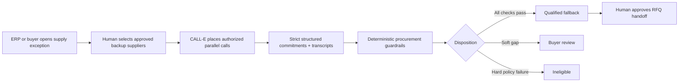

# CapacityLine

**Recover a verified commitment before operations stop.**

CapacityLine is a commitment-recovery system that uses CALL-E to reach pre-approved business contacts, obtain time-bound operational commitments, check them against buyer policy, and give a human operator the first actionable fallback before delay compounds.

Built for the **Most Practical Use Case** prize in [CALL-E: Your Code Is Calling](https://call-e.devpost.com/).

**[Open the zero-call public demo](https://capacityline.vercel.app/demo)** · **[Explore use cases](https://capacityline.vercel.app/solutions)** · **[Evaluation room](https://capacityline.vercel.app/evaluation)** · **[Private Pilot](https://capacityline.vercel.app/pilot)** · **[Watch the 2:44 demo video](https://youtu.be/5ond4ajvsMg)**

Choose **Safe demo** to run the complete fictional scenario with no phone call.

> The included scenario, suppliers, transcripts, impact figures, and benchmark times are fictional. Demo mode never creates a phone call.

## The problem

Risk tools can warn that a supplier is late or disrupted. Supplier databases can suggest alternatives. Neither proves who can supply the required part **right now**, in the required quantity, by the required date, under the buyer's quality and origin rules. Buyers still close that last mile with serial calls, notes, and spreadsheets while the line-stop clock runs.

CapacityLine starts after the exception is known. It turns approved supplier contacts into comparable, evidence-backed commitments:



The north-star metric is **Time to First Qualified Fallback**: elapsed time from the creation of a supply exception to the first transcript-grounded supplier commitment that passes every buyer rule.

## What the demo proves

- A 90-second in-product guide makes the complete buyer journey understandable without training.
- Six executable playbooks cover manufacturing, MRO, construction, food and CPG, logistics, and wholesale replenishment while reusing one policy and evidence core.
- Five fictional supplier outcomes are replayed in parallel without creating a phone call.
- CALL-E is given a goal and a strict per-recipient JSON result schema.
- Quantity, ship date, price, MOQ, exact/substitute part, origin, certifications, quote validity, respondent identity, authority, constraints, and an evidence statement are returned.
- A deterministic policy engine classifies each result as `qualified`, `review`, `ineligible`, or `unreachable`.
- A cheap and fast offer is correctly blocked when its IATF 16949 certification cannot be established.
- The decision spotlight compares the recommended exact-part fallback with that cheaper blocked offer at a glance.
- Every recommendation links back to the words in the transcript that support it.
- A human can approve an RFQ handoff; CapacityLine never places an order or forms a contract.
- A tenant-private commitment graph shows the future data moat: response behavior, promise integrity, and delivery calibration.

## CALL-E integration

CapacityLine uses the official [`@call-e/calle`](https://www.npmjs.com/package/@call-e/calle) TypeScript server SDK. The API key stays on the server.

| Capability | CapacityLine implementation |
| --- | --- |
| Batch calling | One call task contains the authorized supplier recipients. |
| Goal-driven conversation | The task defines the recovery objective and commercial boundaries, not a brittle script. |
| Structured results | A strict recipient JSON schema captures procurement facts. |
| Evidence | The UI retains the evidence statement and transcript turns with the decision. |
| Idempotency | Each recovery run sends a durable idempotency key. |
| Live status | The browser polls the server, which reads status from CALL-E. |
| Webhooks | `/api/webhooks/calle` validates event identity and is deliberately side-effect free in the prototype. |
| Safety | Zero-call public demo, E.164 validation, explicit authorization, mandatory server allow-list, disclosure, and human approval. |

The official CALL-E SDK and API describe structured results, transcripts, batch recipients, evidence, and idempotent task creation in the [CALL-E integration repository](https://github.com/CALLE-AI/call-e-integrations).

## Run locally

Requirements: Node.js 22 or newer.

```bash
npm install
npm run dev
```

Open <http://localhost:3000>. Choose **Safe demo** to run the complete scenario without credentials or phone side effects.

For the shortest product tour, click **Demo guide**, then **Start guided demo**. The fictional scenario resolves in about six seconds and automatically opens the recommended supplier's evidence record. Search is functional and can be focused with `Ctrl+K` or `⌘K`.

### Paid Private Pilot and live verification

The public Vercel deployment is intentionally zero-call: it has no production CALL-E key, creates no phone calls, and cannot incur provider charges. `/pilot` is the commercial entry point. Stripe Checkout may collect a paid pilot subscription, but payment alone never creates a call.

A private live deployment fails closed unless all of these gates pass:

1. the configured non-zero Stripe pilot price has an `active` subscription and a paid invoice at request time;
2. the customer has a valid signed, httpOnly billing entitlement;
3. `CALLE_API_KEY` exists only on the private server;
4. `CALLE_BASE_URL` resolves to the exact official `https://api.heycall-e.com` origin;
5. `CAPACITYLINE_RUN_KEY` is a persisted 32–128 character token for the authorized batch and is never regenerated during an ambiguous retry;
6. every consenting E.164 recipient is in `CALLE_ALLOWED_NUMBERS`, and destination phones are unique within the batch;
7. the operator records the operational purpose, existing supplier relationship, consent reference, jurisdiction/calling-window review, and approved disclosure script;
8. the operator explicitly confirms `AUTHORIZE SUPPLIER RECOVERY`.

Checkout, activation, Customer Portal, and signature-verified Stripe webhooks are implemented at `/api/billing/*` and `/api/webhooks/stripe`. The launch route re-queries Stripe before contacting CALL-E, so cancellation, nonpayment, or an unverifiable subscription blocks the provider request.

To configure a private pilot locally:

1. Create a CALL-E account and obtain a key from the CALL-E dashboard.
2. Copy `.env.example` to `.env.local`.
3. Set `STRIPE_SECRET_KEY`, `STRIPE_PILOT_PRICE_ID`, and a random `BILLING_SESSION_SECRET` of at least 32 characters.
4. Configure a Stripe webhook for `/api/webhooks/stripe` and set `STRIPE_WEBHOOK_SECRET`.
5. Set `CALLE_API_KEY`, keep `CALLE_BASE_URL=https://api.heycall-e.com`, and set `CALLE_ALLOWED_NUMBERS` to only the consenting pilot recipients.
6. Create and persist one `CAPACITYLINE_RUN_KEY` for the authorized batch. Keep it unchanged through every retry and reconciliation; rotate it only before an intentionally new batch.
7. Restart the server, purchase the pilot in Stripe test mode, then open the launch dialog, choose **Private live pilot**, enter unique E.164 numbers, complete the authority record, and type `AUTHORIZE SUPPLIER RECOVERY`.

Live mode creates real outbound calls and may incur charges. It is reserved for paid, customer-isolated pilot environments and consenting recipients. The UI masks demo numbers; no real contact data is committed to this repository. See the [Private Pilot runbook](docs/PRIVATE_PILOT_RUNBOOK.md).

## Quality checks

```bash
npm run check
```

This runs ESLint, the Vitest suite, TypeScript compilation, and a production Next.js build. Production dependencies currently report zero known `npm audit` vulnerabilities.

## Architecture

```text
Browser
  ├─ Recovery desk, policy matrix, transcript drawer
  ├─ Commitment ledger
  └─ Supplier commitment graph
         │
         ▼
Next.js server routes
  ├─ POST /api/billing/checkout    Stripe-hosted subscription checkout
  ├─ GET  /api/billing/activate    bound checkout return + billing entitlement
  ├─ POST /api/billing/portal      Stripe Customer Portal
  ├─ POST /api/calls/launch        billing + consent + allow-list gate
  ├─ GET  /api/calls/:callId       CALL-E status/result proxy
  ├─ POST /api/webhooks/{provider} signature-validated event receivers
  └─ GET  /api/health              non-secret readiness state
         │
         ├──────────────► Stripe
         ▼
@call-e/calle server SDK
         │
         ▼
CALL-E → authorized supplier phones
```

See [Architecture](docs/ARCHITECTURE.md), [Safety and Privacy](docs/SAFETY_AND_PRIVACY.md), and the [Commercial Plan](docs/COMMERCIAL_PLAN.md).

## Submission package

- [Devpost submission draft](docs/DEVPOST_SUBMISSION.md)
- [Three-minute video script](docs/DEMO_SCRIPT.md)
- [Timed English subtitles](docs/CAPACITYLINE_DEMO.srt)
- [Screenshot capture plan](docs/SCREENSHOT_PLAN.md)
- [Release and submission runbook](docs/RELEASE_RUNBOOK.md)
- [Judging strategy](docs/JUDGING_STRATEGY.md)
- [Use-case and campaign system](docs/GTM_USE_CASE_MATRIX.md)
- [Submission checklist](docs/SUBMISSION_CHECKLIST.md)
- [Awesome Phone Call Agents PR draft](docs/AWESOME_PR_DRAFT.md)

## Technology

Next.js 16 · React 19 · TypeScript · Stripe 22 · CALL-E TypeScript SDK 0.6.0 · Vitest · custom CSS

## Status and scope

The public product proof and the paid, managed Private Pilot funnel are implemented. The complete zero-call demo path, policy block, evidence inspection, RFQ approval, ledger, graph, search, billing entitlement, and production build are tested. Live CALL-E integration remains disabled on the public deployment and can be enabled only in a paid, customer-isolated environment with consenting allow-listed recipients. This is a sellable founder-led pilot, not yet an unrestricted self-service SaaS: durable multi-tenant storage, SSO, automated tenant provisioning, production consent records, quotas, and ERP writeback remain scale-stage work.

## License

[MIT](LICENSE)
